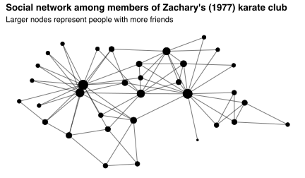
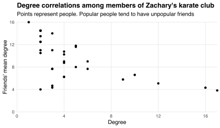
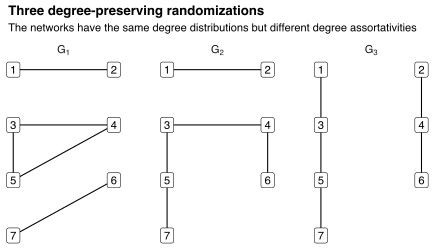

People tend to be less popular than their friends.
This [paradox](https://en.wikipedia.org/wiki/Friendship_paradox), first observed by [Feld (1991)](https://doi.org/10.1086/229693), is due to popular people appearing on many friend lists.

For example, consider the social network among members of a karate club studied by [Zachary (1977)](https://doi.org/10.1086/jar.33.4.3629752):

The network contains `\(n=34\)` nodes with mean degree
`$$\DeclareMathOperator{\Corr}{Corr}
\DeclareMathOperator{\Cov}{Cov}
\DeclareMathOperator{\E}{E}
\DeclareMathOperator{\Var}{Var}
\E[d_i]\equiv\frac{1}{n}\sum_{i=1}^nd_i=4.59,$$`
where `\(\E\)` takes expected values across nodes and `\(d_i\)` is the degree of node `\(i\)`.
If `\(N_i\)` denotes the set of `\(i\)`'s neighbors, then the mean degree among those neighbors equals
`$$f_i\equiv \frac{1}{d_i}\sum_{j\in N_i}d_j.$$`
The friendship paradox states that `\(\E[d_i]\le\E[f_i]\)` in *any* network.
In Zachary's network we have `\(\E[f_i]=9.61\)`, about twice the mean degree.

We can approximate `\(\E[f_i]\)` using the following procedure:

1. Choose a stub (i.e., the endpoint of an edge) uniformly at random.
3. Record the degree of the chosen stub.

Repeating these steps many times yields a degree distribution that over-samples from high-degree nodes.
The mean of this distribution answers the following question: "How many friends does a typical friend have?"
The probability of choosing node `\(i\)` in the first step equals
`$$p_i\equiv \frac{d_i}{\sum_{j=1}^nd_j},$$`
the proportion of stubs that `\(i\)` adds to the network.
Using the probabilities `\(p_i\)` to compute the expected value of the degrees `\(d_i\)` yields an approximation
`$$\begin{align}
\widehat{\E[f_i]}
&= \sum_{i=1}^np_id_i \\
&= \sum_{i=1}^n\left(\frac{d_i}{\sum_{j=1}^nd_j}\right)d_i \\
&= \frac{\sum_{i=1}^nd_i^2}{\sum_{j=1}^nd_j} \\
&= \frac{\E[d_i^2]}{\E[d_i]} \\
&= \E[d_i]+\frac{\Var(d_i)}{\E[d_i]}
\end{align}$$`
of `\(\E[f_i]\)`.
Notice that if `\(\Var(d_i)=0\)` then `\(\widehat{\E[f_i]}=\E[d_i]\)`; in that case, everyone has the same degree as their friends, and so there is no friendship paradox.
The difference between the mean degree `\(\E[d_i]\)` and the typical friend's degree `\(\widehat{\E[f_i]}\)` grows as the variance in degrees grows.

The approximation `\(\widehat{\E[f_i]}\)` is closest to `\(\E[f_i]\)` when there is no [assortative mixing](/blog/assortative-mixing/) with respect to degree.
Then the `\(d_i\)` are uncorrelated with the `\(f_i\)`.
But this isn't true in Zachary's network:

Indeed, in Zachary's network we have `\(\widehat{\E[f_i]}=7.77\)`, which is smaller than the true value `\(\E[f_i]=9.61\)`.
To see why, notice that
`$$\begin{align}
\E[d_if_i]
&= \frac{1}{n}\sum_{i=1}^nd_if_i \\
&= \frac{1}{n}\sum_{i=1}^n\sum_{j\in N_i}d_j \\
&\overset{\star}{=}\frac{1}{n}\sum_{j=1}^nd_j^2 \\
&= \E[d_j^2],
\end{align}$$`
where `\(\star\)` holds because `\(j\)` appears in `\(d_j\)` neighborhoods `\(N_i\)`.
But
`$$\E[d_if_i]=\E[d_if_i]+\Cov(d_i,f_i)$$`
by the definition of covariance, from which it follows that
`$$\widehat{\E[f_i]}=\E[f_i]+\frac{\Cov(d_i,f_i)}{\E[d_i]}.$$`
Thus `\(\widehat{\E[f_i]}\)` under-estimates `\(\E[f_i]\)` in Zachary's network because `\(\Cov(d_i,f_i)=-8.45\)` is negative.

The value of `\(\widehat{\E[f_i]}\)` depends only on the mean and variance of degrees, and not the correlation of degrees across adjacent nodes.
Thus `\(\widehat{\E[f_i]}\)` is invariant to [degree-preserving randomizations](/blog/degree-preserving-randomisation/) (DPRs).
But `\(\E[f_i]\)` can vary under DPRs because they can change the correlation of adjacent nodes' degrees.
For example, consider the three networks shown below:

The networks `\(G_1\)`, `\(G_2\)`, and `\(G_3\)` have the same degree distributions.
As a result, they have the same mean degrees `\(\E[d_i]\)` and approximations `\(\widehat{\E[f_i]}\)` of `\(\E[f_i]\)`.
But the true values of `\(\E[f_i]\)` differ because the correlations `\(\Corr(d_i,f_i)\)` differ:

| Network | `\(\E[d_i]\)` | `\(\widehat{\E[f_i]}\)` | `\(\E[f_i]\)` | `\(\Corr(d_i,f_i)\)` |
|:-------:|:---------:|:-------------------:|:---------:|:----------------:|
|  `\(G_1\)`  |   1.43    |         1.6         |   1.43    |       1.00       |
|  `\(G_2\)`  |   1.43    |         1.6         |   1.57    |       0.20       |
|  `\(G_3\)`  |   1.43    |         1.6         |   1.71    |      -0.91       |

The network `\(G_1\)` is perfectly assortative with respect to degree, so `\(\widehat{\E[f_i]}\)` over-estimates `\(\E[f_i]\)`.
Whereas `\(G_3\)` is dis-assortative with respect to degree, so `\(\widehat{\E[f_i]}\)` under-estimates `\(\E[f_i]\)`.
The network `\(G_2\)` is relatively unsorted, so `\(\widehat{\E[f_i]}\)` is close to `\(\E[f_i]\)`.

