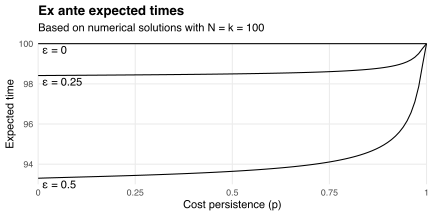
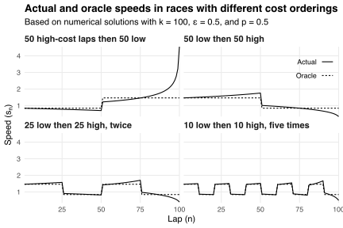

[prev-post]: /blog/optimal-pacing-varying-energy-costs/

[My previous post][prev-post] discussed how I should pace myself in a running race.
I allowed the cost of running fast to vary during the race, and I showed how the costs I faced determined my optimal speeds and finish time.
I assumed that I knew the costs in advance---for example, that I knew which parts of the race had the steepest hills and the strongest headwinds.

But sometimes I *don't* know the costs of running fast in advance.
For example, I might not know the terrain or how the weather will turn out.
This uncertainty prevents me from committing to a pacing strategy before the race begins.
Instead, I must adapt my strategy to the costs I encounter during the race.

This post discusses my optimal pacing strategy when I face random energy costs.
I assume these costs follow a [Markov chain](https://en.wikipedia.org/wiki/Markov_chain).
This allows me to [solve](#solving-the-problem) for my optimal speeds and finish times numerically.
I show that my [*ex ante* expected time](#ex-ante-expected-times) falls when my costs become more variable and less persistent.
I also show that my [realized time](#realized-times) depends on the number and timing of high cost realizations.

## Allowing for random costs

The setup is similar to [my previous post][prev-post]:
I have `\(k>0\)` units of energy to allocate across `\(N\)` laps `\(n\in\{1,2,\ldots,N\}\)`.
It costs `\(c_ns_n\)` units to run at speed `\(s_n\)` in lap `\(n\)`, where the per-unit cost `\(c_n>0\)` varies with `\(n\)`.
I want to minimize my total time
`$$\DeclareMathOperator{\E}{E}
\DeclareMathOperator{\Var}{Var}
\renewcommand{\epsilon}{\varepsilon}
T\equiv\sum_{n=1}^N\frac{1}{s_n}$$`
subject to the dynamic energy constraint
`$$k_{n+1}=k_n-c_ns_n,$$`
boundary conditions `\(k_1=k\)` and `\(k_{N+1}=0\)`, and non-negativity constraint `\(s_n\ge0\)`.
But now the costs `\(c_n\)` are random.
So I can't choose the entire speed sequence `\((s_n)_{n=1}^N\)` before the race begins.
Instead, I choose each term `\(s_n\)` after observing the cost history `\(c_1,c_2,\ldots,c_n\)`.

For simplicity, I assume `\(c_n\in\{1-\epsilon,1+\epsilon\}\)` for some `\(\epsilon\in[0,1)\)`, and that `\(\Pr(c_1=1+\epsilon)=0.5\)` and `\(\Pr(c_{n+1}=c_n)=p\)` for each `\(n\)`.
The probability `\(p\)` controls costs' persistence: if `\(p=1\)` then they never change, whereas if `\(p=0\)` then they change every lap.
The cost in lap `\(n+1\le N\)` has conditional mean
`$$\begin{align}
\E_n[c_{n+1}]
&\equiv \E[c_{n+1}\mid c_1,c_2,\ldots,c_n] \\
&= \begin{cases}
1+(2p-1)\epsilon & \text{if}\ c_n=1+\epsilon \\
1-(2p-1)\epsilon & \text{if}\ c_n=1-\epsilon
\end{cases}
\end{align}$$`
and variance
`$$\begin{align}
\Var_n(c_{n+1})
&= \E_n[c_{n+1}^2]-\E_n[c_{n+1}]^2 \\
&= 4p(1-p)\epsilon^2,
\end{align}$$`
where `\(\E_n\)` takes expectations given the first `\(n\)` cost realizations, and where `\(\epsilon\)` controls the variance of `\(c_{n+1}\)`.
For example, if `\(p=0.5\)` then costs are independent across laps, and so `\(\E_n[c_{n+1}]=1\)` and `\(\Var_n(c_{n+1})=\epsilon^2\)` for each `\(n\)`.
But as `\(p\)` moves away from 0.5, knowing the cost history `\(c_1,c_2,\ldots,c_n\)` gives me more information about `\(c_{n+1}\)`, thereby decreasing `\(\Var_n(c_{n+1})\)`.

## Solving the problem

Facing random costs forces me to solve my pacing problem sequentially: to choose each speed `\(s_n\)` based on the observed cost history `\(c_1,c_2,\ldots,c_n\)` and distribution of future costs `\(c_{n+1},c_{n+2},\ldots,c_N\)`.
This is equivalent to choosing the amount of energy `\(k_{n+1}\)` to carry into the next lap.
I make this choice via the [Bellman equation](https://en.wikipedia.org/wiki/Bellman_equation)
`$$V_n=\min_{k_{n+1}}\left\{\frac{c_n}{k_n-k_{n+1}}+\E_n[V_{n+1}]\right\},$$`
where
`$$V_n\equiv\sum_{m=n}^N\frac{1}{s_m}$$`
is the time taken to run laps `\(n\)` through `\(N\)`.
It turns out that
`$$V_n=\frac{a_n}{k_n}$$`
for each `\(n\in\{1,2,\ldots,N+1\}\)`, where the coefficients `\(a_1,a_2,\ldots,a_{N+1}\)` are defined recursively by
`$$\begin{align}
a_{N+1} &= 0 \\
a_n &= \left(\sqrt{c_n}+\sqrt{\E_n[a_{n+1}]}\right)^2.
\end{align}$$`
If the costs `\(c_n\)` are non-random then the coefficients `\(a_n\)` are also non-random, and we obtain the solution described in [my previous post][prev-post].
But if the costs are random then so are the `\(a_n\)`, and calculating them involves a case-wise analysis that grows exponentially with `\(N\)`.
Instead, I proceed numerically: by computing `\(a_n\)` in each cost state `\(c_n\)` given the implied distribution of future states.
This is possible because the cost sequence is a Markov chain, which means that `\(c_n\)` is a [sufficient statistic](https://en.wikipedia.org/wiki/Sufficient_statistic) for the future costs `\(c_{n+1},c_{n+2},\ldots,c_N\)`.
I use this property to compute the optimal speeds
`$$s_n=\frac{k_n}{c_n+\sqrt{c_n\E_n[a_{n+1}]}}$$`
and finish time `\(T\)` associated with each cost sequence realization.

## *Ex ante* expected times

Consider the case with full cost persistence: `\(p=1\)`.
Then `\(c_n=c_1\)` for each `\(n\)`, from which it follows that `\(T=N^2c_1/k\)`.
But `\(c_1\)` has mean `\(\E[c_1]=1\)`, so my *ex ante* expected time with `\(p=1\)` equals
`$$\E[T\mid p=1]=\frac{N^2}{k}.$$`
This is the finish time I expect if I know costs are constant but don't know if they're high or low.
Conversely, if I know costs always alternate (i.e., that `\(p=0\)`), then my *ex ante* expected time equals
`$$\E[T\mid p=0]=\frac{N^2\E[\sqrt{c_1}]^2}{k}+\begin{cases}
0 & \text{if}\ N\ \text{is even} \\
\Var(\sqrt{c_1})/k & \text{if}\ N\ \text{is odd}.
\end{cases}$$`
The additional `\(\Var(\sqrt{c_1})\)` term when `\(N\)` is odd comes from the cost sequence being imbalanced: it has `\((N-1)/2+1\)` copies of `\(c_1\)` but only `\((N-1)/2\)` copies of the other cost value.
This imbalance becomes inconsequential as `\(N\)` becomes large.
Thus
`$$\begin{align}
\E[T\mid p=1]-\E[T\mid p=0]
&\approx \frac{N^2}{k}\left(1-\E[\sqrt{c_1}]^2\right) \\
&= \frac{N^2}{2k}\left(1-\sqrt{1-\epsilon^2}\right),
\end{align}$$`
which grows with `\(\epsilon\)`.
We can understand this growth via the following chart.
It shows how my expected time increases from `\(\E[T\mid p=0]\)` to `\(\E[T\mid p=1]\)` as `\(p\)` increases from zero to one.
Intuitively, if `\(p\)` is large then I could face persistently high costs that slow me down.
But if `\(p\)` is small then high costs are likely to be "cancelled out" by low costs, improving my optimal time.
The benefit of this canceling grows as the difference `\(2\epsilon\)` between high and low costs grows.

## Realized times

The relationship between my actual and expected times depends on the realized cost sequence.
I demonstrate this dependence in the table below.
It shows the mean (standard deviation) of my actual and expected times across 100 simulated 100-lap races with 25, 50, and 75 high-cost laps.
It also shows the "oracle" time I would obtain if I knew the cost sequence in advance.
This time depends only on the number of high-cost laps, whereas my actual time depends on both the number and order of such laps.
Likewise, my expected time depends only on my parameter choices: `\(N=100\)`, `\(k=100\)`, `\(\epsilon=0.5\)`, and `\(p=0.5\)`.
These parameters are constant across simulated races, so my expected time is also constant.

| High-cost laps |  Actual time  | Expected time | Oracle time |
|:--------------:|:-------------:|:-------------:|:-----------:|
|       25       | 71.38 (0.37)  |     93.65     |    69.98    |
|       50       | 93.50 (0.14)  |     93.65     |    93.30    |
|       75       | 122.00 (0.58) |     93.65     |   119.98    |

I finish faster than expected when I face 25 high-cost laps, which is unexpectedly few.
Whereas I finish slower than expected when I face 75 high-cost laps, which is unexpectedly many.
I always finish slower than the oracle time because I have to optimize my speeds sequentially, whereas the oracle has the option to optimize them all at once.

The difference between my actual and oracle times depends on the order in which I encounter high- and low-cost laps.
For example, consider the following four orderings:

1. 50 high-cost laps followed by 50 low-cost laps;
2. 50 low-cost laps followed by 50 high-cost laps;
3. 25 low-cost laps followed by 25 high-cost laps, repeated twice;
4. 10 low-cost laps followed by 10 high-cost laps, repeated five times.

I assume the same parameters `\((N,k,\epsilon,p)\)` as in the simulations above, so my *ex ante* expected time equals 93.65 in all four orderings.
Likewise, my oracle time equals 93.30 in all orderings because they all contain 50 high-cost laps and 50 low-cost laps.
This oracle time comes from choosing speeds before each race begins, whereas my actual time comes from choosing speeds when I start each lap.
I compare these choices in the chart below.

Consider the first ordering, with 50 high-cost laps followed by 50 low-cost laps.
I start at about the same speed as the oracle.
But I slow down in laps two through 50 to preserve my energy, which is unexpectedly expensive.
I speed up in lap 51 when energy becomes cheap, then keep speeding up as energy keeps being unexpectedly cheap.
I sprint the last few laps to use the excess energy I saved from running slow earlier.
Whereas the oracle never has excess energy: it always uses the optimal amount, maintaining a constant speed in each block of constant-cost laps.
This makes the oracle time 3.6% faster than my actual time.

Now consider the second ordering, with 50 low-cost laps followed by 50 high-cost laps.
Again, I start at about the same speed as the oracle.
But now I *speed up* in laps two through 50 because energy is unexpectedly *cheap*.
I slow down in lap 51 when energy becomes expensive, then keep slowing down as energy keeps being unexpectedly expensive.
I [bonk](https://en.wikipedia.org/wiki/Hitting_the_wall) in the last few laps, having used too much energy by running too fast in the first half.
Whereas the oracle never bonks.
It finishes 4.3% faster than me.

Having shorter blocks of constant-cost laps narrows the gap between my actual and oracle times.
This is because short blocks prevent me from straying too far from the oracle's energy consumption path.
Intuitively, the more frequently I encounter different costs, the more these costs meet my expectations, and so the less I respond to costs being unexpectedly expensive or cheap.
Indeed, my actual time approaches the oracle time as the blocks of constant-cost laps approach one-lap lengths.
This echoes [my earlier discussion](#ex-ante-expected-times) of *ex ante* expected times: I finish faster when costs are less persistent.

