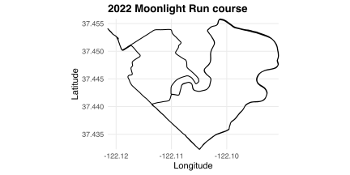
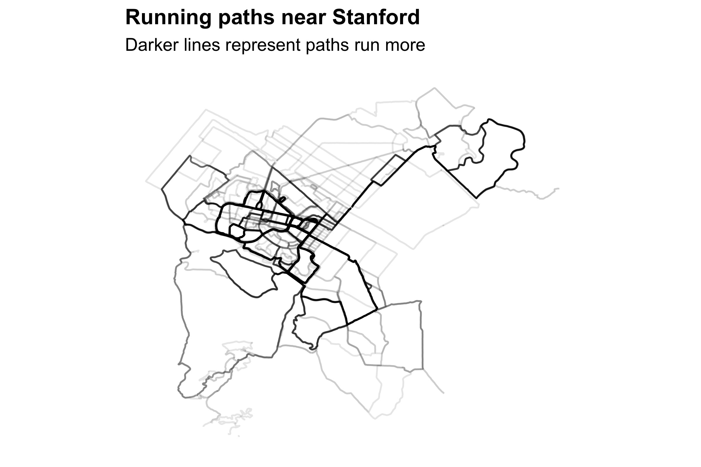
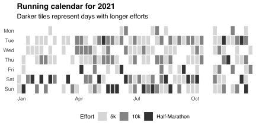
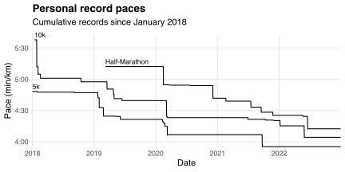

[stravadata](https://github.com/bldavies/stravadata) is an R package I use to organize and analyze my [Strava](https://www.strava.com/) activity data.
This post offers some example analyses:

* [Computing annual totals](#computing-annual-totals)
* [Making activity heat maps](#making-activity-heat-maps)
* [Counting efforts](#counting-efforts)
* [Making training calendars](#making-training-calendars)
* [Tracking personal records](#tracking-personal-records)

My examples use data on my running activities from the last five years:

```r
library(dplyr)
library(lubridate)
library(stravadata)

runs = activities %>%
  filter(type == 'Run') %>%
  mutate(year = year(start_time),
         date = date(start_time)) %>%
  filter(year %in% 2018:2022)
```

## Computing annual totals

`runs` contains activity-level features like distance traveled and time spent moving.
I sum these features by year, then use `knitr::kable` to display these sums in a table:

```r
library(knitr)

runs %>%
  group_by(Year = year) %>%
  summarise(Runs = n(),
            `Distance (km)` = sum(distance) / 1e3,
            `Time (hours)` = sum(time_moving) / 3600) %>%
  mutate_at(3:4, ~format(round(.), big.mark = ',')) %>%
  kable(align = 'crrr')
```

| Year | Runs| Distance (km)| Time (hours)|
|:----:|----:|-------------:|------------:|
| 2018 |   68|           544|           52|
| 2019 |  152|         1,085|           92|
| 2020 |  224|         2,026|          172|
| 2021 |  207|         2,149|          173|
| 2022 |  145|         1,517|          120|

## Making activity heat maps

I record my runs with a watch that tracks my GPS coordinates.
stravadata stores these coordinates in `streams`.
For example, here's the course for last year's [Moonlight Run](https://www.paloaltoonline.com/moonlight_run/) in Palo Alto:

```r
library(ggplot2)

p = runs %>%
  filter(name == 'Moonlight Run' & year == 2022) %>%
  select(id) %>%
  left_join(streams, by = 'id') %>%
  ggplot(aes(lon, lat)) +
  geom_path()

plot_nicely(p)  # Add text and formatting
```



Combining the GPS coordinates from many runs yields a local map.
For example, suppose I want to map my runs near [Stanford](/blog/stanford/).
I first make a table of GPS paths near a local landmark:

```r
coords = c(-122.16, 37.44)  # Trader Joe's
tol = 0.08

stanford_paths = streams %>%
  semi_join(runs, by = 'id') %>%
  mutate(step = row_number()) %>%
  filter(sqrt((lon - coords[1]) ^ 2 + (lat - coords[2]) ^ 2) < tol) %>%
  filter(lon != lag(lon) | lat != lag(lat)) %>%  # Remove pauses
  mutate(new_path = row_number() == 1 | id != lag(id) | step != lag(step) + 1) %>%
  mutate(path = cumsum(new_path)) %>%
  select(path, lat, lon)
```

I increment `path` every time I start a new run, unpause a previous run, or re-enter the area defined by `coords` and `tol`.
I use `path` as a grouping variable so that `ggplot2::ggplot` knows to draw each path separately.
I then use the `alpha` argument of `ggplot2::geom_path` to create a "heat map" of paths I run most often:

```r
p = stanford_paths %>%
  ggplot(aes(lon, lat, group = path)) +
  geom_path(alpha = 0.1)

plot_nicely(p)
```



## Counting efforts

`best_efforts` stores my fastest times running a range of distances (that Strava calls "efforts") within each activity:

```r
head(best_efforts)
```

```
## # A tibble: 6 × 4
##           id effort   start_index end_index
##        <dbl> <chr>          <int>     <int>
## 1 1253004287 1 mile            15       447
## 2 1253004287 1/2 mile          11       232
## 3 1253004287 1k                12       284
## 4 1253004287 2 mile            11       876
## 5 1253004287 400m              11       120
## 6 1253004287 5k                11      1342
```

The `id` column stores activity IDs and the `effort` column stores effort descriptions.
I focus on 5k, 10k, and half marathon efforts:

```r
focal_efforts = c('5k', '10k', 'Half-Marathon')

efforts = runs %>%
  left_join(best_efforts, by = 'id') %>%
  filter(effort %in% focal_efforts) %>%
  mutate(effort = factor(effort, focal_efforts)) %>%
  select(year, date, id, effort, start_index, end_index)
```

`efforts` inherits the `year` variable from `runs`.
I use this variable to count efforts within each year.
I then use `tidyr::spread` and `knitr::kable` to display these counts in a table:

```r
library(tidyr)

efforts %>%
  count(Year = year, effort) %>%
  spread(effort, n, fill = 0) %>%
  kable(align = 'c')
```

| Year | 5k  | 10k | Half-Marathon |
|:----:|:---:|:---:|:-------------:|
| 2018 | 64  | 24  |       0       |
| 2019 | 136 | 34  |       2       |
| 2020 | 191 | 88  |      21       |
| 2021 | 200 | 90  |      25       |
| 2022 | 131 | 85  |       9       |

## Making training calendars

`efforts` also inherits the `date` variable from `runs`.
I use this variable to create [GitHub-esque](https://github.blog/2013-01-07-introducing-contributions/#contributions-calendar) training calendars.
For example, here's my running calendar for 2021:

```r
p = efforts %>%
  filter(year == 2021) %>%
  group_by(date) %>%
  slice_max(effort) %>%
  distinct(effort) %>%  # I ran twice on some days
  mutate(Week = floor_date(date, 'weeks', week_start = 1),
         Weekday = wday(date, label = T, week_start = 1)) %>%
  ggplot(aes(Week, Weekday)) +
  geom_tile(aes(alpha = effort), col = 'white', linewidth = 0.5)

plot_nicely(p)
```



I use `lubridate::floor_date` to identify weeks and `lubridate::wday` to identify weekdays.
The `col` and `size` arguments of `ggplot2::geom_tile` add space between tiles.

## Tracking personal records

I combine `runs`, `streams`, and `efforts` to track my record running paces over time.
I follow a three-step process:

First, I compute the mean pace for each effort.
I do this using the `start_index` and `end_index` columns that `efforts` inherits from `best_efforts`.
These columns tell me where each effort occurs in the corresponding activity's stream:

```r
effort_paces = streams %>%
  filter(id %in% runs$id) %>%
  # Create indices
  group_by(id) %>%
  mutate(index = row_number()) %>%
  ungroup() %>%
  # Extract stream segment for each effort
  inner_join(efforts, by = 'id') %>%
  filter(index >= start_index & index <= end_index) %>%
  # Compute mean paces
  group_by(id, date, effort) %>%
  summarise(distance = max(distance) - min(distance),
            time = max(time) - min(time)) %>%
  ungroup() %>%
  mutate(pace = (time / 60) / (distance / 1e3))

head(effort_paces)
```

```
## # A tibble: 6 × 6
##           id date       effort distance  time  pace
##        <dbl> <date>     <fct>     <dbl> <dbl> <dbl>
## 1 1335437333 2018-01-01 5k        5002.  1442  4.81
## 2 1338123783 2018-01-03 5k        5000.  1605  5.35
## 3 1344338907 2018-01-07 5k        5000.  1455  4.85
## 4 1347622521 2018-01-09 5k        5000   1493  4.98
## 5 1353889714 2018-01-13 5k        5001.  1622  5.41
## 6 1353889714 2018-01-13 10k      10001.  3380  5.63
```

The values in the `distance` column differ slightly from the descriptions in the `effort` column.
This is because the stream segment doesn't always cover the described distance exactly.
But the multiplicative errors in `distance` and `time` should be equal on average, making `pace` is an unbiased estimate of my true mean pace.
I measure this pace in minutes per kilometer.

Next, I extract my record paces by deleting efforts slower than my previous best:

```r
record_paces = effort_paces %>%
  group_by(effort) %>%
  arrange(date) %>%
  filter(pace == cummin(pace)) %>%
  ungroup()
```

Finally, I "fill in the gaps" by adding days on which I *don't* set a new record.
I do this using `tidyr::crossing` and `tidyr::fill`:

```r
date_range = seq(date('2018-01-01'), date('2022-12-31'), by = 'day')

record_paces_filled = crossing(date = date_range, effort = focal_efforts) %>%
  left_join(record_paces) %>%
  group_by(effort) %>%
  fill(pace) %>%
  filter(!is.na(pace))
```

`record_paces` and `record_paces_filled` differ in that the latter includes date-effort pairs with no new records.
This makes `record_paces_filled` produce horizontal lines when I plot its data:

```r
p = record_paces_filled %>%
  ggplot(aes(date, pace, group = effort)) +
  geom_line()

plot_nicely(p)
```



