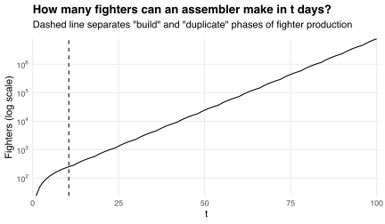

This week's [Riddler Classic](https://fivethirtyeight.com/features/can-you-fend-off-the-alien-armada/) asks us to fend off an alien invasion:

> The astronomers of Planet Xiddler are back in action!
> Unfortunately, this time they have used their telescopes to spot an armada of hostile alien warships on a direct course for Xiddler.
> The armada will be arriving in exactly 100 days.
> (Recall that, like Earth, there are 24 hours in a Xiddler day.)
>
> Fortunately, Xiddler's engineers have just completed construction of the planet's first assembler, which is capable of producing any object.
> An assembler can be used to build a space fighter to defend the planet, which takes one hour to produce.
> An assembler can also be used to build another assembler (which, in turn, can build other space fighters or assemblers).
> However, building an assembler is more time-consuming, requiring six whole days.
> Also, you cannot use multiple assemblers to build one space fighter or assembler in a shorter period of time.
>
> What is the greatest number of space fighters the Xiddlerian fleet can have when the alien armada arrives?

We can solve this problem via [dynamic programming](https://en.wikipedia.org/wiki/Dynamic_programming).
First, let `\(N(t)\)` be the maximum number of fighters an assembler can make in `\(t\)` days.
The aliens invade in 100 days, so our goal is to compute `\(N(100)\)`.

An assembler can either

1. spend a day building fighters, or
2. spend six days duplicating itself.

The first option gives us 24 fighters plus however many an assembler can make in `\((t-1)\)` days.
The second option gives us however many *two* assemblers can make in `\((t-6)\)` days.
Thus `\(N(t)\)` satisfies the [Bellman equation](https://en.wikipedia.org/wiki/Bellman_equation)
`$$N(t)=\max\{24+N(t-1),2N(t-6)\},$$`
where `\(N(t)=0\)` for all `\(t\le0\)`.
Solving this equation recursively gives
`$$N(100)=7,\!864,\!320.$$`
The chart below shows how `\(N(t)\)` grows with `\(t\)`:

Fighter production begins with a 90-day "duplicate" phase in which the number of assemblers doubles 15 times: once every six days.
This gives us
`$$2^{15}=32,\!768$$`
assemblers to use during a 10-day "build" phase in which each builds 24 fighters per day, giving us
`$$2^{15}\times10\times24=7,\!864,\!320$$`
fighters in total.

The length of the build phase depends on how quickly an assembler can build fighters or duplicate itself.
For example, if it takes only three days to duplicate then the build phase lasts only four days.
This is because the opportunity cost of duplicating (not building now) falls relative to the benefit of duplicating (building twice as fast later).
The opposite is true if it takes more than six days to duplicate or if assemblers can build more than 24 fighters per day.

