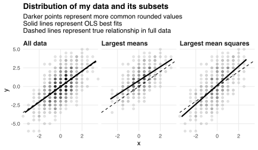
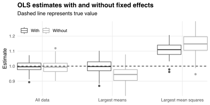

Economists often use [fixed effects](https://en.wikipedia.org/wiki/Fixed_effects_model) to correct for [selection bias](/blog/understanding-selection-bias).
Intuitively, these effects "partial out" the reasons why our data include some observations but not others.
But this intuition relies on the selection criteria being linear functions of the dependent variable.

For example, suppose I have panel data on 100 individuals `\(i\)` at ten dates `\(t\)`.
These data include pairs `\((y_{it},x_{it})\)` generated by the process
`$$y_{it}=x_{it}+u_i+\epsilon_{it},$$`
where `\(u_i\)` is a fixed effect and `\(\epsilon_{it}\)` is an error term.
The `\(x_{it}\)`, `\(u_i\)`, and `\(\epsilon_{it}\)` are iid normal with zero mean and unit variance.
They all vary across individuals.
The `\(x_{it}\)` and `\(\epsilon_{it}\)` also vary over time, but the `\(u_i\)` do not.

The chart below plots `\(y_{it}\)` against `\(x_{it}\)` overall and within two subsets of my data:

1. Observations for the 50 individuals `\(i\)` whose outcomes `\(y_{it}\)` have the largest mean;
2. Observations for the 50 individuals `\(i\)` whose *squared* outcomes `\(y_{it}^2\)` have the largest mean.

It also shows the OLS regression line fitted to my data and its subsets.
The intercept and slope of this line depend on the selection criterion.
Individuals with larger mean outcomes tend to have larger fixed effects and narrower error distributions.
This leads OLS to estimate a higher intercept but shallower slope than in the full data.
In contrast, individuals with larger mean squared outcomes have similar fixed effects to other individuals but wider error distributions.
This leads OLS to estimate the same intercept but steeper slope than in the full data.

What if I include fixed effects in my regression?
The box plots below summarize the slopes I estimate when I simulate my data 100 times and apply my selection criteria.
Including fixed effects removes the bias from selecting on mean outcomes.
This is because the fixed effects *are* the variables I select on.
Partialing them out removes the selection bias by definition.
In contrast, including fixed effects does not remove the bias from selecting on mean squared outcomes.
This is because the fixed effects are uncorrelated with the variables I select on.
Partialing them out removes noise but not bias.

