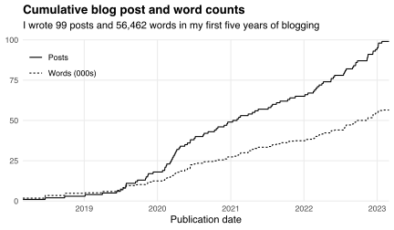

Today marks five years since [my first blog post](/blog/habitat-choices-first-generation-pokemon/).
This post is my 100th.
It summarizes the [words I've used](#words-used) and [traffic I've received](#traffic).

## Words used

My first 99 posts contained more than 56 thousand words:

I wrote 11 posts in March and April 2020, when the pandemic forced me to "work" from home.
I've written 56 posts---about once every 16 days---since [starting my PhD](/blog/stanford/) in September 2020.

My [longest post](/blog/applying-economics-phd-programs) had 2,128 words and my [shortest](/blog/transitivity-positive-correlations) had 123.
The most common (non-[stop](https://en.wikipedia.org/wiki/Stop_word)) word was "network," used 269 times across 34 distinct posts.
The chart below shows the six most common words overall and among posts on my most common topics.
It includes "datum" rather than "data" because I [lemmatize](https://en.wikipedia.org/wiki/Lemmatisation) words before counting them.

So far I've written 34 posts on [economics](/topics/economics) and 31 on [networks](/topics/networks).
Most posts had multiple topics.
The most commonly paired topics were networks and [research](/topics/research) (eight posts), research and [software](/topics/software) (six posts), and networks and [statistics](/topics/statistics) (six posts).

## Traffic

Since March 2020 I've used [GoatCounter](https://www.goatcounter.com) to count page views and visitors.
I had lots in late 2022, when I shared my [reflections on graduate school](/blog/reflections-grad-school-years-1-2) and people started [applying to economics PhD programs](/blog/applying-economics-phd-programs):

My most popular three posts benefit from being in the top few Google search results.
They account for about half of my (non-bot) page views:

|Post                                                |  Views|
|:---------------------------------------------------|------:|
|[Applying to economics PhD programs](/blog/applying-economics-phd-programs)|  4,174|
|[Accessing the Strava API with R](/blog/accessing-strava-api)|  1,831|
|[Greedy Pig strategies](/blog/greedy-pig-strategies)|  1,189|
|[Reflections on grad school: Years 1 and 2](/blog/reflections-grad-school-years-1-2)|    411|
|[Stanford](/blog/stanford)                          |    387|
|[DeGroot learning in social networks](/blog/degroot-learning-social-networks)|    341|
|[Ordinary and total least squares](/blog/ordinary-total-least-squares)|    336|
|[Female representation and collaboration at the NBER](/blog/female-representation-collaboration-nber)|    318|
|[What's it like living in America?](/blog/living-america)|    296|
|[How central is Grand Central Terminal?](/blog/how-central-grand-central-terminal)|    280|
|Other                                               |  4,747|
|Total                                               | 14,310|

Most of my visitors were from the USA (usually California or Massachusetts):

|Country        | Visitors|
|:--------------|--------:|
|United States  |    6,216|
|United Kingdom |      770|
|Australia      |      642|
|New Zealand    |      561|
|India          |      294|
|Other/unknown  |    3,856|
|Total          |   12,339|

