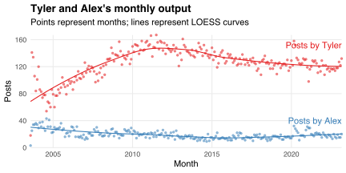
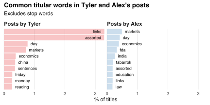
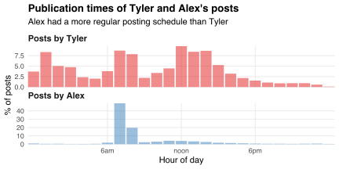
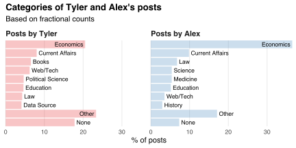
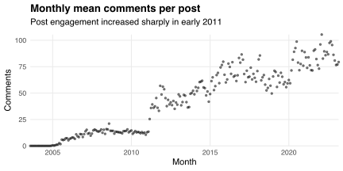
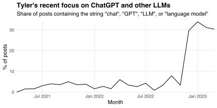

Today I released the R package [MRposts](https://github.com/bldavies/MRposts).
It contains data on [*Marginal Revolution*](https://marginalrevolution.com) blog posts: their [authors](#authors), [titles](#titles), [publication times](#publication-times), [categories](#categories), and [comment counts](#comments).
I describe these data below.
They cover all 34,189 posts published between August 2003 and March 2023.

## Authors

*Marginal Revolution* is run by [Tyler Cowen](https://en.wikipedia.org/wiki/Tyler_Cowen) and [Alex Tabarrok](https://en.wikipedia.org/wiki/Alex_Tabarrok).
They wrote 86% and 13% of the posts in MRposts.
The rest were written by several guest bloggers.
I count posts by author in the table below.

|Author                                    |  Posts|
|:-----------------------------------------|------:|
|Tyler Cowen                               | 29,373|
|Alex Tabarrok                             |  4,564|
|Fabio Rojas                               |     63|
|Justin Wolfers                            |     24|
|Steven Landsburg                          |     19|
|Robin Hanson                              |     17|
|Tim Harford                               |     15|
|Craig Newmark                             |     14|
|Ed Lopez                                  |     12|
|Bryan Caplan                              |     11|
|Eric Helland                              |     11|
|Angus Grier                               |     10|
|12 others, each with fewer than ten posts |     56|

Tyler wrote [the first *Marginal Revolution* post](https://marginalrevolution.com/marginalrevolution/2003/08/the_lunar_men) on August 21, 2003, and posted every day thereafter.
His monthly output grew during the late 2000s and early 2010s.
Alex's monthly output was lower but relatively constant:

## Titles

My next chart compares the words used in Tyler and Alex's posts' titles.
Their posts often contained "assorted links" or "facts of the day," or explained how there are "markets in everything."
Tyler also had many posts on "sentences to ponder" and "what [he'd] been reading."

The longest title contained 21 words ("The Icelandic Stock Exchange fell by 76% in early trading as it re-opened after closing for two days last week.").
Tyler's titles had a median of five words while Alex's had a median of four.[^nagelberg]

[^nagelberg]: Mark Nagelberg [compares](https://www.marknagelberg.com/lets-scrape-a-blog-part-1/) the mean lengths of all authors' titles.

## Publication times

*Marginal Revolution* posts tended to appear in early mornings and afternoons.
Tyler posted at all hours of the day, albeit seldom at night.[^noel]
Alex's posting schedule was more regular.
His posts usually appeared between 7am and 9am:

[^noel]: Hamilton Noel [looks closer](https://hamiltonnoel.substack.com/p/does-tyler-cowen-sleep) at Tyler's blogging habits.

## Categories

MRposts matches posts with their [categories](https://marginalrevolution.com/categories).
The most common categories were Economics (12,757 posts), Current Affairs (5,648 posts), and Law (3,706 posts).
About 52% of posts had two or more categories, while 16% had none.

The following chart compares the categories of Tyler and Alex's posts.
I count posts "fractionally" so that, e.g., posts with two categories contribute half a post to each category.
Tyler wrote proportionally more non-Economics posts than Alex.

## Comments

The median post in MRposts had 26 comments.
Tyler's median post had 27 comments while Alex's had 25.
About 11% of posts had more than 100 comments, while 26% had fewer than ten and 11% had none.
I list the most-commented-on posts in the table below.

|Post                                                             | Year| Comments|
|:----------------------------------------------------------------|----:|--------:|
|[Sarah Palin](https://marginalrevolution.com/marginalrevolution/2008/08/sarah-palin)| 2008|      947|
|[The Case for Getting Rid of Borders-Completely](https://marginalrevolution.com/marginalrevolution/2015/10/the-case-for-getting-rid-of-borders-completely)| 2015|      711|
|[If you wish to debate SCOTUS on Roe v. Wade...](https://marginalrevolution.com/marginalrevolution/2022/06/if-you-wish-to-debate-scotus-on-roe-v-wade)| 2022|      577|
|[Classical liberalism vs. The New Right](https://marginalrevolution.com/marginalrevolution/2022/10/classical-liberalism-vs-the-new-right)| 2022|      567|
|[What the hell is going on?](https://marginalrevolution.com/marginalrevolution/2016/05/what-in-the-hell-is-going-on)| 2016|      562|
|[Upward Mobility and Discrimination: Asians and African Americans](https://marginalrevolution.com/marginalrevolution/2016/11/upward-mobility-discrimination-asians-african-americans)| 2016|      548|
|[CWT bleg](https://marginalrevolution.com/marginalrevolution/2022/12/cwt-bleg)| 2022|      534|
|[Ferguson and the Modern Debtor's Prison](https://marginalrevolution.com/marginalrevolution/2014/08/ferguson-and-the-debtors-prison)| 2014|      525|
|[Trump winning: who rises and falls in status?](https://marginalrevolution.com/marginalrevolution/2016/11/trump-winning-rises-falls-status)| 2016|      520|
|[What is neo-reaction?](https://marginalrevolution.com/marginalrevolution/2016/06/what-is-neo-reaction)| 2016|      519|

Three of the ten most-commented-on posts were published in the last year.
Indeed, the mean number of comments per post grew over time:

Post engagement grew slowly during the late 2010s.
It increased sharply in early 2011, when Tyler was [listed among the most influential economists](https://www.economist.com/free-exchange/2011/02/01/economics-most-influential-people).

## Content

I could update MRposts to include data on posts' content.
This would allow users to mine the text of Tyler and Alex's posts.
For example, many commenters have decried Tyler's recent focus on ChatGPT and other large language models.
I document that focus in the chart below.
It shows the share of Tyler's posts containing the string "chat", "GPT", "LLM", or "language model" in each of the past 24 months.
The majority of those posts contained none of those strings!

