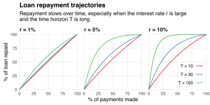

Suppose I take out a loan.
It gains interest at rate `\(r\)`, compounded continuously.
I repay the loan by making constant, continuous payments until time `\(T\)`.
How does the repaid share of my loan vary over time?
And how does it depend on `\(r\)` and `\(T\)`?

Let `\(P_0\)` be the initial value of my loan: the "principal."
Then my continuous payments `\(C\)` must satisfy
`$$\begin{align}
P_0
&= \int_0^TCe^{-r\tau}\,\mathrm{d}\tau \\
&= \frac{C}{r}\left(1-e^{-rT}\right)
\end{align}$$`
and so the value of my remaining payments at time `\(t\in[0,T]\)` equals
`$$\begin{align}
P_t
&\equiv \int_t^TCe^{-r(\tau-t)}\,\mathrm{d}\tau \\
&= \frac{C}{r}\left(1-e^{-r(T-t)}\right) \\
&= P_0\left(\frac{e^{-rt}-e^{-rT}}{1-e^{-rT}}\right)e^{rt}.
\end{align}$$`
If I don't make any payments before time `\(t\)` then the principal grows to `\(P_0e^{rt}\)`.
Therefore, the value of my repayments up to time `\(t\)` equals the difference `\((P_0e^{rt}-P_t)\)`.

Now let `\(x\equiv t/T\in[0,1]\)` be share of payments I've made up to time `\(t\)`.
The chart below plots the corresponding share
`$$\frac{P_0e^{rt}-P_t}{P_0e^{rt}}\bigg\rvert_{t=xT}=\frac{1-e^{-xrT}}{1-e^{-rT}}$$`
of the loan that I've repaid.
This share grows with `\(x\)` at a decreasing rate.
Intuitively, my repayment "slows down" because the interest on the principal and payments grows larger than the payments themselves.
This slowing effect is stronger when the interest rate `\(r\)` is larger and time horizon `\(T\)` is longer.

