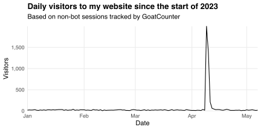
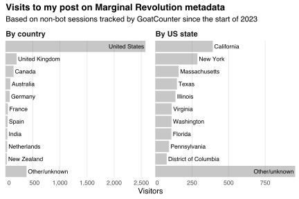

Here's a summary of my website's traffic since the start of 2023:

Notice the spike on April 9, when Tyler Cowen [linked](https://marginalrevolution.com/marginalrevolution/2023/04/sunday-assorted-links-413.html) to [my post of *Marginal Revolution* metadata](/blog/marginal-revolution-metadata).
That post is now my second most-viewed ever (just behind my post on [applying to economics PhD programs](/blog/applying-economics-phd-programs)).

Where in the world did those views come from?
Here's a summary:

Most visitors came from the US.
This makes sense: *Marginal Revolution* is run by American authors who tend to focus on American issues.
About a third of my US-based visitors came from California, New York, or Massachusetts.
Bigger states tended to bring more visitors, but the relationship was not perfect.
For example, Californians comprise about 11.7% of the US population but 15.2% of my visitors.
These percentages differ due to selection effects: *Marginal Revolution* caters to educated readers who share the authors' interests.
Indeed, all my visitors saw the word "metadata" and thought "I want to know more."
I doubt the typical American would react similarly!

