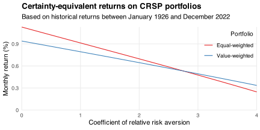
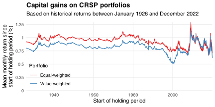

Imagine two portfolios of S&P 500 companies.
One portfolio weights all companies equally; the other weights companies by their market capitalization (hereafter "value").
Which portfolio is the better investment?

One way to answer this question is to look at historical data.
For example, the Center for Research in Security Prices (CRSP) [provides](https://www.crsp.org/products/documentation/crsp-indexes-sp-500%C2%AE-universe-0) monthly returns on each portfolio between January 1926 and December 2022.
I summarize these returns in the table below.
They had overall means of 1.13% and 0.94%, standard deviations of 6.72% and 5.42%, and a Pearson correlation of 0.96.

|Portfolio      | Mean| Std. dev.|    Min| Median|   Max|
|:--------------|----:|---------:|------:|------:|-----:|
|Equal-weighted | 1.13|      6.72| -31.00|   1.36| 68.04|
|Value-weighted | 0.94|      5.42| -28.75|   1.30| 41.43|

Suppose past and future returns have the same distribution.
Then I expect the returns on the equal-weighted portfolio to be larger but riskier.
So my preference over portfolios depends on my risk tolerance.
I demonstrate this dependence in the chart below.
It shows the certainty-equivalent (CE) return on each portfolio for a range of [relative risk aversion](https://en.wikipedia.org/wiki/Risk_aversion#Relative_risk_aversion) (RRA) coefficients.
The CE return equals the mean return when my RRA coefficient equals zero.
It falls when my RRA coefficient rises because I demand a larger risk premium.
The rate at which the CE return falls depends on portfolio's return distribution.
Based on the distributions summarized above, I prefer the equal-weighted portfolio whenever my RRA coefficient is less than 2.76.[^crra]

[^crra]: For reference, most macro/finance research uses coefficients between one and three.

Another way to compare the two portfolios is to look at their long-term growth rates.
I do that in the chart below.
It shows the capital gain I would have realized if I bought each portfolio in the past, reinvested my dividends, and sold my holdings at the end of 2022.[^covid]
I make these gains comparable across holding periods by presenting them as mean monthly returns.
For example, investing in the equal-weighted portfolio in December 2002 would have led to the same capital gain as investing in an asset that returned 0.90% every month for the next 20 years.

[^covid]: I focus on investments made before January 2020 to suppress the noise from (i) the COVID-19 pandemic and (ii) having few observations with which to compute means.

If I invested in either portfolio before September 2010, then I would have earned more on the equal-weighted portfolio.
Its dominance over the value-weighted portfolio peaked in early 2000, when the [dot-com crash](https://en.wikipedia.org/wiki/Dot-com_bubble) saw lots of large companies lose lots of value.

Of course, past and future returns can differ.
The equal-weighted portfolio may have been the better investment 20 years ago but could be a worse investment today.
So what does the theory say?

[Malladi and Fabozzi (2017)](https://doi.org/10.1057/s41260-016-0033-4) argue that the equal-weighted portfolio offers higher returns because it is regularly [rebalanced](https://en.wikipedia.org/wiki/Rebalancing_investments).
For example, if I start with equal shares in two companies, but one doubles in value and the other halves, then my portfolio will end with a 80/20 split.
So if I want to maintain equal weights then I need to sell companies that grow a lot and buy companies that don't.
This [contrarian](https://en.wikipedia.org/wiki/Contrarian_investing) strategy takes advantage of [mean reversion](https://en.wikipedia.org/wiki/Mean_reversion_(finance)).
Indeed [Plyakha et al (2021)](https://doi.org/10.1007/978-3-030-66691-0_9) argue that maintaining *unequal* weights would also lead to higher mean returns.
These arguments agree with empirical evidence that few, if any, investing strategies consistently outperform weighting stocks equally (e.g., [DeMiguel et al, 2009](https://doi.org/10.1093/rfs/hhm075); [Hsu et al, 2018](https://doi.org/10.1016/j.jbankfin.2018.09.021); [Qin and Singal, 2022](https://doi.org/10.1007/s11156-021-01008-w)).

---

*Thanks to [John Shoven](https://profiles.stanford.edu/john-shoven) for inspiring this post.*
