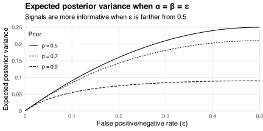

Suppose I receive a [noisy signal](/blog/learning-noisy-signals/) `\(s\in\{0,1\}\)` about an unknown state `\(\omega\in\{0,1\}\)`.
The signal has false positive rate
`$$\renewcommand{\epsilon}{\varepsilon}
\Pr(s=1\mid\omega=0)=\alpha$$`
and false negative rate
`$$\Pr(s=0\mid\omega=1)=\beta$$`
with `\(\alpha,\beta\in[0,0.5]\)`.[^wlog]
I use these rates, my prior belief `\(p=\Pr(\omega=1)\)`, and [Bayes' rule](https://en.wikipedia.org/wiki/Bayes%27_theorem) to form a posterior belief
`$$\begin{align}
q_s
&\equiv \Pr(\omega=1\mid s) \\
&= \frac{\Pr(s\mid\omega=1)\Pr(\omega=1)}{\Pr(s)} \\
&= \begin{cases}
  \frac{\beta p}{(1-\alpha)(1-p)+\beta p} & \text{if}\ s=0 \\
  \frac{(1-\beta)p}{\alpha(1-p)+(1-\beta)p} & \text{if}\ s=1
\end{cases}
\end{align}$$`
that depends on the signal I receive.

[^wlog]: There is no loss in generality from assuming `\(\alpha,\beta\le0.5\)` because observing `\(s\)` is the same as observing `\((1-s)\)`.

Now suppose I take an action `\(a\in[0,1]\)` with cost `\(c(a,\omega)\equiv(a-\omega)^2\)`.
I want to minimize my expected cost
`$$\DeclareMathOperator{\E}{E}
\begin{align}
\E[c(a,\omega)\mid s]
&= (1-q_s)c(a,0)+q_sc(a,1) \\
&= (1-q_s)a^2+q_s(a-1)^2
\end{align}$$`
given `\(s\)`, which leads me to choose `\(a=q_s\)`.
Then my minimized expected cost
`$$\begin{align}
\E[c(q_s,\omega)\mid s]
&= q_s(1-q_s) \\
&= p(1-p)\times\begin{cases}
  \frac{(1-\alpha)\beta}{\left((1-\alpha)(1-p)+\beta p\right)^2} & \text{if}\ s=0 \\
  \frac{\alpha(1-\beta)}{\left(\alpha(1-p)+(1-\beta)p\right)^2} & \text{if}\ s=1
\end{cases}
\end{align}$$`
equals the posterior variance in my belief about `\(\omega\)` after receiving `\(s\)`.
The expected value of this variance *before* receiving `\(s\)` equals
`$$\begin{align}
V(p,\alpha,\beta)
&\equiv q_0(1-q_0)\Pr(s=0)+q_1(1-q_1)\Pr(s=1) \\
&= p(1-p)\times\frac{\alpha(1-\alpha)(1-p)+\beta(1-\beta)p}{\left((1-\alpha)(1-p)+\beta p\right)\left(\alpha(1-p)+(1-\beta)p\right)},
\end{align}$$`
which depends on my prior `\(p\)` as well as the error rates `\(\alpha\)` and `\(\beta\)`.
For example, the chart below plots
`$$V(p,\epsilon,\epsilon)=p(1-p)\times\frac{\epsilon(1-\epsilon)}{p(1-p)+\epsilon(1-\epsilon)(1-2p)^2}$$`
against `\(\epsilon\)` when `\(p\in\{0.5,0.7,0.9\}\)`.
If `\(\epsilon=0\)` then the signal is fully informative because it always matches the state `\(\omega\)`.
Larger values of `\(\epsilon\le0.5\)` lead to less precise posterior beliefs.
Indeed if `\(\epsilon=0.5\)` then the signal is uninformative because `\(\Pr(s=1)=0.5\)` (and, hence, `\(q_0=q_1=p\)`) independently of `\(\omega\)`.
The slope `\(\partial V(p,\epsilon,\epsilon)/\partial\epsilon\)` falls as my prior `\(p\)` moves away from `\(0.5\)` because having a more precise prior makes my beliefs less sensitive to the signal.

The next chart shows the contours of `\(V(p,\alpha,\beta)\)` in the `\(\alpha\beta\)`-plane.
These contours are symmetric across the diagonal line `\(\alpha=\beta\)` when my prior `\(p\)` equals `\(0.5\)` but asymmetric when `\(p\not=0.5\)`.
Intuitively, if I have a strong prior that `\(\omega=1\)` then positive signals `\(s=1\)` are less surprising, and shift my belief less, than negative signals `\(s=0\)`.
So if `\(p>0.5\)` then I need to increase the false positive rate `\(\alpha\)` by more than I decrease the false negative rate `\(\beta\)` to keep `\(V(p,\alpha,\beta)\)` constant.

One consequence of this asymmetry is that the constrained minimization problem
`$$\min_{\alpha,\beta}V(p,\alpha,\beta)\ \text{subject to}\ 0\le\alpha,\beta\le0.5\ \text{and}\ \alpha+\beta\ge B$$`
has a corner solution
`$$(\alpha^*,\beta^*)=\begin{cases}
(0,B) & \text{if}\ p\le1/2 \\
(B,0) & \text{if}\ p>1/2
\end{cases}$$`
for all lower bounds `\(B\in[0,0.5]\)` on the sum of the error rates.
Intuitively, if I can limit my exposure to false positives and negatives then I should prevent whichever occur in the state that's most likely under my prior.
For example, if `\(p>0.5\)` then I'm best off allowing some false positives but preventing any false negatives.
This makes negative signals fully informative because they only occur when `\(\omega=0\)`.

