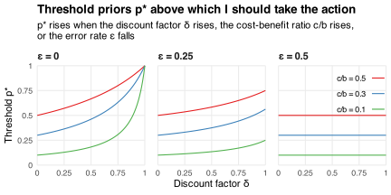

This post is about waiting for information before taking an action.
It uses a simple model to explain when and why waiting is valuable.
It formalizes some ideas discussed in my posts on [climate change](/blog/climate-change-transport-planning/) and [pandemic](/blog/policymaking-under-uncertainty/) policy.

Suppose it costs `\(c>0\)` to take an action that pays `\(b>c\)` if it is beneficial (`\(\omega=1\)`) and zero otherwise (`\(\omega=0\)`).
I take the action if its expected net benefit
`$$\newcommand{\E}{\mathrm{E}}
\E[\omega b-c]=pb-c$$`
exceeds zero, where `\(p=\Pr(\omega=1)\)` is my prior belief about `\(\omega\)`.
Thus, my decision rule is to take the action whenever `\(p\)` exceeds the cost-benefit ratio `\(c/b\)`.

Now suppose I can wait for a [noisy signal](/blog/learning-noisy-signals/) `\(s\in\{0,1\}\)` with error rate
`$$\renewcommand{\epsilon}{\varepsilon}
\Pr(s\not=\omega\mid \omega)=\epsilon\in[0,0.5].$$`
I use my prior, the signal, and Bayes' rule to form a posterior belief
`$$\begin{align}
q_s
&\equiv \Pr(\omega=1\mid s) \\
&= \begin{cases}
\frac{\epsilon p}{(1-\epsilon)(1-p)+\epsilon p} & \text{if}\ s=0 \\
\frac{(1-\epsilon)p}{\epsilon(1-p)+(1-\epsilon)p} & \text{if}\ s=1
\end{cases}
\end{align}$$`
about `\(\omega\)`.
Then I take the action if its expected net benefit
`$$\begin{align}
\E[\omega b-c\mid s]
&= q_sb-c
\end{align}$$`
given `\(s\)` exceeds zero.
This happens with probability
`$$\Pr(q_sb-c\ge0)=\begin{cases}
1 & \text{if}\ c/b\le q_0 \\
\Pr(s=1) & \text{if}\ q_0<c/b\le q_1 \\
0 & \text{if}\ q_1<c/b,
\end{cases}$$`
where the probability
`$$\Pr(s=1)=\epsilon(1-p)+(1-\epsilon)p$$`
of receiving a positive signal depends on my prior `\(p\)` and the error rate `\(\epsilon\)`.

If `\(c/b\le q_0\)` or `\(q_1<c/b\)` then the signal doesn't affect whether I take the action, so I don't need to wait.
But if `\(q_0<c/b\le q_1\)` then waiting gives me a [real option](https://en.wikipedia.org/wiki/Real_options_valuation) not to take the action if I learn it isn't beneficial.
So the expected benefit of waiting equals
`$$\begin{align}
W
&\equiv \delta\,\E\left[\E[\max\{0,q_sb-c\}\mid s]\right] \\
&= \begin{cases}
\delta(pb-c) & \text{if}\ c/b\le q_0 \\
\delta(q_1b-c)\Pr(s=1) & \text{if}\ q_0<c/b\le q_1 \\
0 & \text{if}\ q_1<c/b,
\end{cases}
\end{align}$$`
where the discount factor `\(\delta\in[0,1]\)` captures
(i) my patience and
(ii) my confidence that the action will still be available if I wait.

I should take the action *before* receiving `\(s\)` if and only if the expected net benefit `\((pb-c)\)` under my prior exceeds `\(W\)`.
This happens precisely when my prior exceeds
`$$p^*\equiv\frac{(1-\delta\epsilon)c}{b-\delta((1-\epsilon)b-(1-2\epsilon)c)}.$$`
The following chart plots `\(p^*\)` against `\(\delta\)` when `\(c/b\in\{0.1,0.3,0.5\}\)` and `\(\epsilon\in\{0,0.25,0.5\}\)`.
Increasing the discount factor `\(\delta\)` or the cost-benefit ratio `\(c/b\)` raises the option value of waiting, which raises the threshold prior `\(p^*\)` above which I should take the action.
Increasing the error rate `\(\epsilon\)` makes the signal less informative, which *lowers* the option value of waiting and, hence, lowers `\(p^*\)`.
If `\(\epsilon=0.5\)` then the signal is uninformative and so `\(p^*=c/b\)` independently of `\(\delta\)`.

