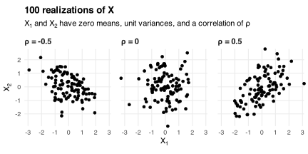
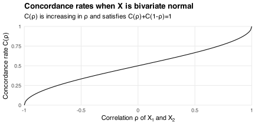

Let `\(X=(X_1,X_2)\)` be a random vector in `\(\mathbb{R}^2\)`.
Two realizations `\(x\)` and `\(x'\)` of `\(X\)` form a [concordant pair](https://en.wikipedia.org/wiki/Concordant_pair) if `\((x_2'-x_2)\)` and `\((x_1'-x_1)\)` have the same sign.
What's the probability of sampling a concordant pair when `\(X\)` is bivariate normal?

For example, suppose `\(X_1\)` and `\(X_2\)` have zero means, unit variances, and a correlation of `\(\rho\)`.
The scatter plots below show 100 realizations of `\((X_1,X_2)\)` when `\(\rho\in\{-0.5,0,0.5\}\)`.
These realizations contain
`$$\binom{100}{2}=4,\!950$$`
pairs, of which 36% are concordant when `\(\rho=-0.5\)`.
This percentage rises to 48% when `\(\rho=0\)` and to 71% when `\(\rho=0.5\)`.
Increasing `\(\rho\)` makes concordance more likely because it makes `\((X_2-X_1)\)` larger and less noisy.

Different samples give different concordance rates due to sampling variation.
We can remove this variation by deriving the concordance rate analytically.
To begin, suppose `\(X\)` has mean `\(\mathrm{E}[X]=(\mu_1,\mu_2)\)` and covariance matrix
`$$\mathrm{Var}(X)=\begin{bmatrix}
\sigma_1^2 & \rho\sigma_1\sigma_2 \\
\rho\sigma_1\sigma_2 & \sigma_2^2
\end{bmatrix}.$$`
Then `\(X_2\mid X_1\)` is normal with mean
`$$\mathrm{E}[X_2\mid X_1]=\mu_2+\frac{\rho\sigma_2}{\sigma_1}(X_1-\mu_1)$$`
and variance
`$$\mathrm{Var}(X_2\mid X_1)=(1-\rho^2)\sigma_2^2.$$`
So for any two realizations `\(x\)` and `\(x'\)` of `\(X\)` we can write
`$$\renewcommand{\epsilon}{\varepsilon}
x'_2-x_2=\frac{\rho\sigma_2}{\sigma_1}\left(x'_1-x_1\right)+\epsilon$$`
with `\(\epsilon\sim N(0,2(1-\rho^2)\sigma_2^2)\)`.
Now `\(x'_1-x_1\sim N(0,2\sigma_1^2)\)` is normal, and so
`$$z\equiv \frac{x'_1-x_1}{\sigma_1\sqrt{2}}$$`
is standard normal and exceeds zero if and only if `\(x'_1>x_1\)`.
Letting `\(f\)` and `\(\phi\)` be the density functions for `\(\epsilon\)` and `\(z\)` then gives
`$$\newcommand{\der}{\mathrm{d}}
\begin{align}
\Pr(x'_2>x_2\ \text{and}\ x'_1>x_1)
&= \Pr(\sqrt{2}\rho\sigma_2 z+\epsilon>0\ \text{and}\ z>0) \\
&= \int_0^\infty\left(\int_{-\sqrt{2}\rho\sigma_2 z}^\infty f(\epsilon)\,\der \epsilon\right)\phi(z)\,\der z \\
&\overset{\star}{=} \int_0^\infty\left(\int_{\frac{-\rho z}{\sqrt{1-\rho^2}}}^\infty \phi(w)\,\der w\right)\phi(z)\,\der z \\
&= \int_0^\infty\left(1-\Phi\left(\frac{-\rho z}{\sqrt{1-\rho^2}}\right)\right)\phi(z)\,\der z \\
&\overset{\star\star}{=} \frac{1}{2}-\int_0^\infty\Phi\left(\frac{-\rho z}{\sqrt{1-\rho^2}}\right)\phi(z)\,\der z,
\end{align}$$`
where `\(\Phi\)` is the standard normal CDF, where `\(\star\)` uses the change of variables
`$$w\equiv \frac{\epsilon}{\sigma_2\sqrt{2(1-\rho^2)}},$$`
and where `\(\star\star\)` uses the symmetry of `\(\phi\)` about `\(z=0\)`.
But `\(f\)` is symmetric about `\(\epsilon=0\)`, which implies
`$$\Pr(x'_2>x_2\ \text{and}\ x'_1>x_1)=\Pr(x'_2<x_1\ \text{and}\ x'_1<x_1),$$`
and therefore
`$$\begin{align}
C(\rho)
&\equiv \Pr(x\ \text{and}\ x'\ \text{are concordant}) \\
&= \Pr(x'_2>x_2\ \text{and}\ x'_1>x_1)+\Pr(x'_2<x_1\ \text{and}\ x'_1<x_1) \\
&= 1-2\int_0^\infty\Phi\left(\frac{-\rho z}{\sqrt{1-\rho^2}}\right)\phi(z)\,\der z.
\end{align}$$`
The concordance rate `\(C(\rho)\)` depends on the correlation `\(\rho\)` of `\(X_1\)` and `\(X_2\)`, but not their means or variances.
It has value `\(C(0)=0.5\)` when `\(\rho=0\)` because `\(\Phi(0)=0.5\)` is constant.
Intuitively, if `\(X_1\)` and `\(X_2\)` are uncorrelated then we can't use `\((x'_1-x_1)\)` to predict `\((x'_2-x_2)\)`, which is equally likely to be positive or negative.
Whereas if `\(\lvert\rho\rvert=1\)` then `\((x'_1-x_1)\)` predicts `\((x'_2-x_2)\)` perfectly, and so
`$$\lim_{\rho\to1}C(\rho)=1$$`
and
`$$\lim_{\rho\to-1}C(\rho)=0.$$`
The chart below verifies that the concordance rate `\(C(\rho)\)` grows with `\(\rho\)`.
It also shows that
`$$C(\rho)+C(1-\rho)=1.$$`
Thus, for example, we have `\(C(-0.5)=1/3\)` and `\(C(0.5)=2/3\)`.
These values remove the sampling error from the estimates 0.36 and 0.71 obtained using the 100 realizations above.

