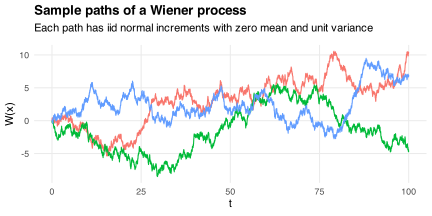
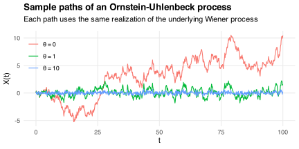

A (standard) [Wiener process](https://en.wikipedia.org/wiki/Wiener_process) is a continuous-time stochastic process `\(\{W(t)\}_{t\ge0}\)` with initial value `\(W(0)=0\)` and instantaneous increments
`$$\newcommand{\der}{\mathrm{d}}
\der W(t)\sim N(0,\der t).$$`
We can simulate such a process as follows.
First, create a sequence of times `\(t\)` at which to store the value of `\(W(t)\)`:

```r
t_max = 100
dt = 1e-2

t = seq(0, t_max, by = dt)
```

Increasing `t_max` creates a longer path, while decreasing `dt` creates a smoother path.
Now simulate the random increments and take their cumulative sum:

```r
dW = rnorm(length(t) - 1, mean = 0, sd = sqrt(dt))
W = c(0, cumsum(dW))
```

Here are three sample paths generated by this procedure:



We can use `\(\{W(t)\}_{t\ge0}\)` to construct an [Ornstein-Uhlenbeck process](https://en.wikipedia.org/wiki/Ornstein–Uhlenbeck_process) `\(\{X(t)\}_{t\ge0}\)`.
This process has instantaneous increments
`$$\der X(t)=-\theta X(t)\der t+\der W(t),$$`
where `\(\theta\ge0\)` controls the process' tendency to [mean-revert](https://en.wikipedia.org/wiki/Regression_toward_the_mean).
We can compute its values `\(X(t)\)` by iterating over `dW`:

```r
theta = 1

X = rep(0, length(dW))
i = 1
while (i < length(dW)) {
  X[i + 1] = X[i] - theta * X[i] * dt + dW[i + 1]
  i = i + 1
}
```

The chart below compares the sample paths obtained using different `\(\theta\)` values.
Each path uses the same realization of the underlying Wiener process `\(\{W(t)\}_{t\ge0}\)`.
If `\(\theta=0\)` then `\(X(t)=W(t)\)` for all `\(t\ge0\)`.
The mean magnitude of `\(X(t)\)` falls as `\(\theta\)` rises because this makes the process more mean-reverting.



