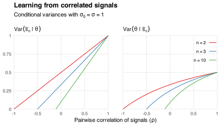

Suppose I want to learn the value of a parameter `\(\theta\in\mathbb{R}\)`.
My prior is that `\(\theta\)` is normally distributed with variance `\(\sigma_0^2\)`.
I observe `\(n\ge1\)` signals
`$$\DeclareMathOperator{\Cor}{Cor}
\DeclareMathOperator{\E}{E}
\DeclareMathOperator{\Var}{Var}
\newcommand{\R}{\mathbb{R}}
\renewcommand{\epsilon}{\varepsilon}
s_i=\theta+\epsilon_i$$`
of `\(\theta\)`.
The errors `\(\epsilon_i\)` in these signals are independent of `\(\theta\)`.
They are jointly normally distributed with equal variances `\(\Var(\epsilon_i)=\sigma^2\)` and pairwise correlations
`$$\Cor(\epsilon_i,\epsilon_j)=\begin{cases}
1 & \text{if}\ i=j \\
\rho & \text{otherwise}.
\end{cases}$$`
I assume `\(-1/(n-1)\le\rho\le1\)` so that this distribution is feasible.[^feasible]

[^feasible]: For example, it is impossible for three normal variables to have equal variances and pairwise correlations of `\(-1\)`.
See [here](/blog/transitivity-positive-correlations/) for an explanation.

Observing `\(s_1,s_2,\ldots,s_n\)` is the same to observing the sample mean
`$$\bar{s}_n\equiv\frac{1}{n}\sum_{i=1}^ns_i,$$`
which is normally distributed and has conditional variance
`$$\Var(\bar{s}_n\mid\theta)=\frac{(1+(n-1))\rho\sigma^2}{n}$$`
under my prior.
The posterior distribution of `\(\theta\)` given `\(\bar{s}_n\)` is also normal and has variance
`$$\Var(\theta\mid\bar{s}_n)=\left(\frac{1}{\sigma_0^2}+\frac{n}{(1+(n-1)\rho)\sigma^2}\right)^{-1}.$$`
Both variances are
(i) decreasing in `\(n\)` when `\(\rho<1\)` and
(ii) increasing in `\(\rho\)` when `\(n>1\)`.
Intuitively, if the signals are not perfectly correlated then observing more gives me more information about `\(\theta\)`.
If they are negatively correlated then their errors "cancel out" and the sample mean `\(\bar{s}_n\)` gives me a precise estimate of `\(\theta\)`.

The chart below shows how `\(\Var(\bar{s}_n\mid\theta)\)` and `\(\Var(\theta\mid\bar{s}_n)\)` vary with `\(\rho\)` and `\(n\)` when `\(\sigma_0=\sigma=1\)`.
If `\(\rho=-1/(n-1)\)` then `\(\epsilon_1+\epsilon_2+\cdots+\epsilon_n=0\)`, and so `\(\Var(\bar{s}_n\mid\theta)=0\)` and `\(\Var(\theta\mid\bar{s}_n)=0\)` because `\(\bar{s}_n=\theta\)`.
Whereas if `\(\rho=1\)` then signals `\(s_2\)` through `\(s_n\)` provide the same information as `\(s_1\)`, and so `\(\Var(\bar{s}_n\mid\theta)=\Var(s_1\mid\theta)\)` and `\(\Var(\theta\mid\bar{s}_n)=\Var(\theta\mid s_1)\)`.

