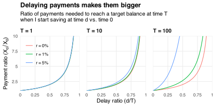

Suppose I want to retire at time `\(T>0\)`.
I make constant payments to a savings account that earns continuously compounded interest `\(r>0\)`.
I want my retirement fund to be worth `\(V>0\)` today (time `\(0\)`).
How much bigger do my payments have to be if I delay them?

Let `\(X_d\)` be the payments I have to make if I start saving at time `\(d\in[0,T]\)`.
These payments form an [annuity](https://en.wikipedia.org/wiki/Annuity) with value
`$$\frac{X_d}{r}\left(1-e^{-r(T-d)}\right)$$`
at time `\(d\)`.
I want this value to equal `\(Ve^{rd}\)`.
So my payments must equal
`$$\begin{align}
X_d
&= \frac{r}{1-e^{-r(T-d)}}\times Ve^{rd} \\
&= \frac{rV}{e^{-rd}-e^{-rT}}.
\end{align}$$`
Therefore, delaying to time `\(d\)` increases my payments by a factor of
`$$\frac{X_d}{X_0}=\frac{1-e^{-rT}}{e^{-rd}-e^{-rT}}.$$`
The chart below shows how `\(X_d/X_0\)` grows with the proportion of time `\(d/T\)` I delay saving.
Part of this growth comes from having less time remaining: if my savings earn no interest, then the factor
`$$\lim_{r\to0}\frac{X_d}{X_0}=\frac{T}{T-d}$$`
equals the ratio of time until retirement and time spent saving.
Raising `\(r\)` raises `\(X_d/X_0\)` because I forgo more opportunities to earn interest on my interest the longer I delay.
This is especially true when I'm far from retiring (i.e., `\(T\)` is large).

---

*Thanks to [Michael Boskin](https://profiles.stanford.edu/michael-boskin) for inspiring this post.*
