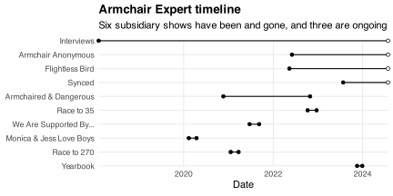
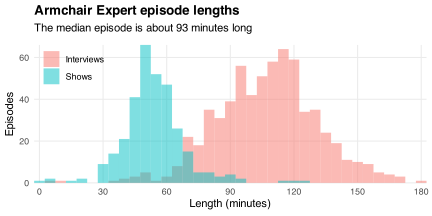

[*Armchair Expert*](https://armchairexpertpod.com) is a podcast hosted by [Dax Shepard](https://en.wikipedia.org/wiki/Dax_Shepard) and [Monica Padman](https://en.wikipedia.org/wiki/Monica_Padman).
They interview celebrities, scientists, and other public figures.
They also publish some subsidiary "shows" via the podcast's main feed.
The table below counts episodes by show:

|Show                    | Episodes|
|:-----------------------|--------:|
|Interviews              |      655|
|Armchair Anonymous      |       98|
|Flightless Bird         |       94|
|Synced                  |       52|
|Armchaired & Dangerous  |       21|
|Race to 35              |       12|
|We Are Supported By...  |       12|
|Monica & Jess Love Boys |       11|
|Race to 270             |       11|
|Yearbook                |        8|
|Total                   |      974|

I store episodes' metadata in the R package [ArmchairExpert](https://github.com/bldavies/ArmchairExpert).
It contains a single table, `episodes`, with a row for each episode and seven columns:

* `id`: Episode ID on Spotify
* `date`: Episode release date
* `title`: Episode title
* `show`: Show to which episode belongs
* `number`: Within-show episode number
* `duration`: Episode length (in seconds)
* `description`: Episode description

<!-- I list episodes' Spotify IDs because I collect their metadata via the [Spotify API](https://developer.spotify.com/documentation/web-api). -->

The first *Armchair Expert* episode---an interview with Dax's wife, [Kristen Bell](https://en.wikipedia.org/wiki/Kristen_Bell)---was released in February 2018.
The earliest show ([Monica & Jess Love Boys](https://armchairexpertpod.com/monica-jess-love-boys)) started in February 2020 and ended two months later.
Other shows have been and gone, and three are ongoing:

My favorite show is [Flightless Bird](https://armchairexpertpod.com/flightless-bird).
It's hosted by [David Farrier](https://en.wikipedia.org/wiki/David_Farrier), a fellow Kiwi who reflects on [living in the USA](/blog/living-america/).

The median episode is about 93 minutes long.
But most interviews are longer and most shows are shorter:

Most interviews end with a "fact check," during which Dax and Monica discuss the interview and their lives.
Fact checks can be as long as the interviews themselves.

Dax and Monica have interviewed some people many times.
They've interviewed Kristen Bell five times, and [David Sedaris](https://en.wikipedia.org/wiki/David_Sedaris) and [Sanjay Gupta](https://en.wikipedia.org/wiki/Sanjay_Gupta) four times each.[^many-interviews]
My favorite interviews are with [Esther Perel](https://en.wikipedia.org/wiki/Esther_Perel), [Wendy Mogel](https://en.wikipedia.org/wiki/Wendy_Mogel), and [Terry Crews](https://en.wikipedia.org/wiki/Terry_Crews).

[^many-interviews]: Adam Grant, Ashton Kutcher, Jason Bateman, Vincent D'Onofrio, and Yuval Noah Harari have been interviewed three times each.

