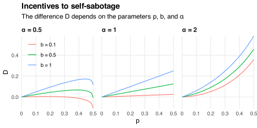

On [this week's episode](https://www.ted.com/podcasts/malcolm-gladwell-on-the-importance-of-self-correction-transcript) of the *ReThinking* podcast, [Adam Grant](https://adamgrant.net) describes how people sabotage themselves:

> "Let's say you're going into a difficult math test and you're afraid of finding out that you're not smart enough to do it.
> What do you do?
> You don't start studying until the night before, or you don't study at all.
> And then, when you fail, you can say, "well, I didn't try."
> And you don't have to face the threat to your fundamental aptitude."

This argument reminds me of the literature on "career concerns."
That literature explores the incentive problems that arise when employees care about their reputations.
One problem is that they avoid taking profitable but risky actions (see, e.g., [Aghion and Jackson (2016)](https://doi.org/10.1257/mic.20150083)).
This happens when the actions' outcomes provide information about the employee's ability.

For example, consider fund managers.
Good managers can identify good investments; bad managers cannot.
But some good investments go bad by chance, making good managers look bad and getting them fired.
This discourages managers from making risky investments (see, e.g., [Chevalier and Ellison (1999)](https://doi.org/10.1162/003355399556034)).
Instead they make safe bets, hiding their ability but hurting the fund's performance.

Adam's test-taker has similar incentives.
They don't want to find out their "fundamental aptitude" is low.
If they don't prepare for the test and fail it, then they can blame their lack of preparation rather than their lack of talent.
But they might pass the test if they prepare for it!
So when deciding how hard to study, the test-taker needs to consider two forces: studying harder

1. makes them more likely to pass but also
2. makes their (in)ability harder to ignore if they fail.

These forces can complement or compete with each other, depending on their magnitudes and directions.
I illustrate this dependence in the [model](/blog/what-economic-model/) below.[^model]

[^model]: I present a similar model in [my paper on simple advice](/blog/why-experts-give-simple-advice).

## Model

Suppose I can either succeed `\((s=1)\)` or fail `\((s=0)\)` at achieving a goal.
The probability with which I succeed depends on my effort `\(e\)`, which I can choose to be low `\((e=L)\)` or high `\((e=H)\)`.
It also depends on my ability `\(a\)`, which is also low `\((a=L)\)` or high `\((a=H)\)`.

If I choose low effort, then I'm equally likely to succeed regardless of my ability:
`$$\Pr(s=1\mid e=L,a)=0.5$$`
for each `\(a\in\{L,H\}\)`.
But if I choose high effort, then my success probability improves if and only if I have high ability:
`$$\Pr(s=1\mid e=H,a)=\begin{cases}
0.5 & \text{if}\ a=L \\
0.5+p & \text{if}\ a=H
\end{cases}$$`
with `\(0<p\le 0.5\)`.

I don't know my ability and don't get to choose it.
My prior belief is that I'm equally likely to have high or low ability: `\(\Pr(a=H)=0.5\)`.
I use [Bayes' rule](https://en.wikipedia.org/wiki/Bayes%27_theorem) to update this belief based on my effort `\(e\)` and outcome `\(s\)`.
My posterior belief is
`$$\begin{align}
q(e,s)
&\equiv \Pr(a=H\mid e,s) \\
&= \frac{\Pr(s\mid e,a=H)\Pr(a=H)}{\Pr(s\mid e)} \\
&= \begin{cases}
0.5 & \text{if}\ e=L \\
\frac{0.5-p}{1-p} & \text{if}\ e=H\ \text{and}\ s=0 \\
\frac{0.5+p}{1+p} & \text{if}\ e=H\ \text{and}\ s=1.
\end{cases}
\end{align}$$`
My beliefs never change if I choose low effort.
This choice makes `\(s\)` an uninformative [signal](/blog/learning-noisy-signals/) because I'm equally likely to succeed regardless of my ability.
In contrast, my beliefs always change if I choose high effort.
This choice makes `\(s\)` an informative signal because I'm more likely to succeed if my ability is high than if it is low.
Increasing `\(p\)` [deconvolutes](https://en.wikipedia.org/wiki/Deconvolution) the signal and makes it more informative, leading to more extreme posterior beliefs.

My payoff has two components.
The first depends on my outcome: I receive `\(b>0\)` if `\(s=1\)` and zero otherwise.
The second component depends on my beliefs: I receive "ego utility"
`$$u(q)=\left(\frac{q}{0.5}\right)^\alpha-1$$`
from having posterior belief `\(q\)` about my ability.
The function `\(u\)` is increasing in `\(q\)` and has value `\(u(0.5)=0\)` if my beliefs don't change.
The parameter `\(\alpha>0\)` determines the function's curvature: it is concave if `\(\alpha<1\)`, linear if `\(\alpha=1\)`, and convex if `\(a>1\)`.

I choose the effort `\(e^*\in\{L,H\}\)` that maximizes my *ex ante* expected payoff
`$$\begin{align*}
U(e)
&\equiv \Pr(s=1\mid e)\ b \\
&\quad +\Pr(s=1\mid e)\ u(q(e,1))+\Pr(s=0\mid e)\ u(q(e,0)),
\end{align*}$$`
which has values
`$$U(L)=0.5b$$`
and
`$$\begin{align*}
U(H)
&= 0.5(1+p)b \\
&\quad +0.5(1+p)\left(\frac{1+2p}{1+p}\right)^\alpha+0.5(1-p)\left(\frac{1-2p}{1-p}\right)^\alpha-1.
\end{align*}$$`
I choose high effort if and only if the difference
`$$D\equiv U(H)-U(L)$$`
is positive.
This difference depends on the parameters `\(p\)`, `\(b\)`, and `\(\alpha\)`:

If I choose high effort, then increasing `\(p\)` has two effects:

1. it makes me more likely to succeed;
2. it makes the random outcome `\(s\)` more informative about my ability.

The first effect always makes me better off.
The second effect makes me better off when `\(\alpha>1\)` but worse off when `\(\alpha<1\)`.
This is because `\(\alpha\)` controls whether I like `\((\alpha>1)\)` or dislike `\((\alpha<1)\)` variation in my posterior beliefs.
If `\(\alpha<1\)`, then I have diminishing returns to ego boosts: I lose more from learning I have low ability than I gain from learning I have high ability.
This makes me want a narrower distribution of posterior beliefs.
So I'm tempted to sabotage myself, choosing low effort to protect my ego.
This temptation is strongest when the benefit `\(b\)` of achieving my goal is small and when the signal `\(s\)` is very informative (i.e., when `\(p\)` is large).

