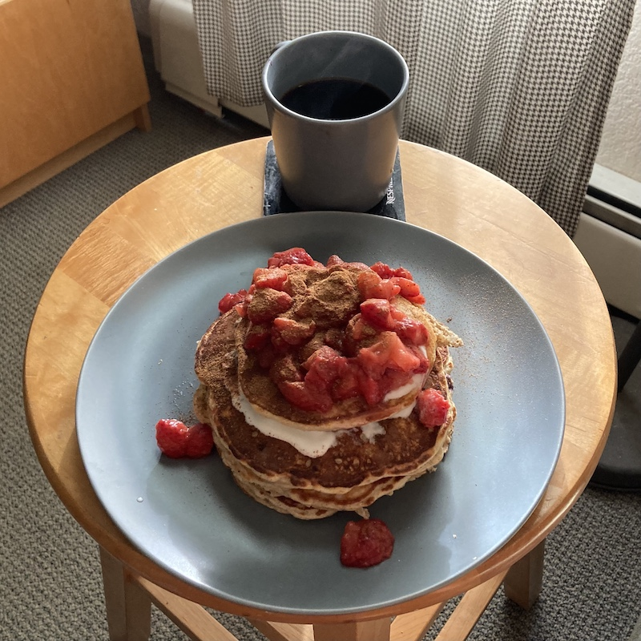

I make pancakes from scratch most mornings.
Here's my method:

1. Blend 45 grams of rolled oats.
2. Mix the blended oats with
   * a tablespoon of cornstarch,
   * half a teaspoon of baking powder,
   * 40 grams of vanilla protein powder,
   * a teaspoon of cinnamon,
   * half a teaspoon of nutmeg, and
   * a pinch of salt.
3. In a separate bowl, combine
   * two whisked eggs,
   * 120 grams of greek yoghurt,
   * a splash of milk,
   * a finely diced (almost mashed) banana, and
   * half a cup of blueberries.
4. Combine the wet and dry ingredients.
5. Make some coffee while the batter rests for 5--10 minutes.
6. Fry the batter on medium heat, flipping once when bubbles form.
7. Serve with yoghurt, strawberries, and a sprinkle of cinnamon.

The finished product looks like this:

I use oats, rather than flour, to make my pancakes slightly healthier and nuttier.
Casein protein powder holds more moisture than whey; I use 20 grams of each.
If I'm out of yoghurt, then I use cottage cheese.
It tastes similar but burns easier and leaves more lumps.
Sometimes I replace the banana and blueberries with pumpkin purée.

Happy stacking!
